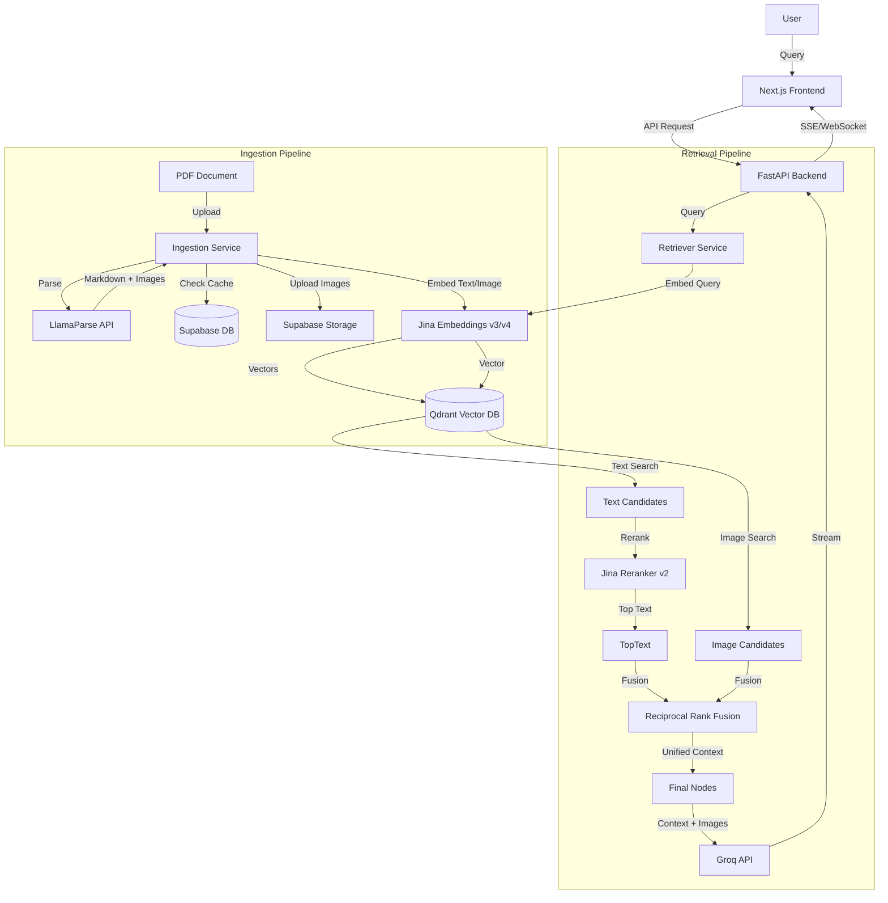

# ModalMuse 🎵🖼️

**ModalMuse** is a high-performance **Multi-Modal Retrieval-Augmented Generation (RAG)** system that seamlessly integrates text and image data to provide rich, context-aware answers. Built with privacy, speed, and accuracy in mind, it leverages state-of-the-art embedding models, vector databases, and LLMs to understand and generate content across modalities.

## 🚀 Features

-   **Multi-Modal Indexing**: Parses complex PDFs (text + images) using **LlamaParse** and indexes them into a unified vector space.
-   **Hybrid Retrieval Engine**: Orchestrates parallel searches for text chunks and visual assets.
-   **Advanced "Double Reranking"**:
    1.  **Semantic Reranking**: Refines text results using Jina AI's Cross-Encoder.
    2.  **RRF Fusion**: Combines text and image rankings using Reciprocal Rank Fusion for balanced multi-modal context.
-   **Streaming Response**: Real-time status updates (Embedding → Searching → Reranking → Generation) via WebSockets.
-   **Smart Caching**: Uses Supabase to cache parse results and image assets, drastically reducing costs and processing time.
-   **Vision-Capable LLM**: Powered by **llama-4-maverick-17b-128e-instruct** (via Groq) to "see" retrieved images and answer questions about them.

---

## 🏗️ Architecture

The system follows a microservices-inspired architecture, separating ingestion, retrieval, and frontend presentation.



---

## 🛠️ Technology Stack

| Component | Technology | Description |
| :--- | :--- | :--- |
| **Frontend** | **Next.js** | React framework for a responsive, modern UI. |
| **Backend** | **FastAPI** | High-performance Python async API. |
| **Vector DB** | **Qdrant** | Stores dense vectors for both text and images. |
| **Embeddings** | **Jina Embeddings v4** | State-of-the-art embedding model for text and images (8k context). |
| **Reranker** | **Jina Reranker v2** | Cross-encoder for precise text relevance scoring. |
| **LLM** | **llama-4-maverick-17b-128e-instruct** | Multimodal LLM served via **Groq** for lightning-fast inference. |
| **Parsing** | **LlamaParse** | Specialized parser for extracting tables and images from PDFs. |
| **Caching** | **Supabase** | Postgres for metadata cache and Storage for image assets. |

---

## 🔍 Deep Dive: Indexing & Retrieval Flow

### 1. Reliable Ingestion (The "Content-Aware" Parser)
Instead of simple text extraction, we use **LlamaParse** to understand the document layout. It treats images as first-class citizens, extracting them separately while maintaining their relationship to the surrounding text.
-   **Challenge**: Repeatedly parsing the same PDF is slow and expensive.
-   **Solution**: We implemented a SHA-256 hash-based caching system on **Supabase**. If a file is re-uploaded, we fetch the parsed JSON and images immediately from the cache.

### 2. Double Reranking Strategy
A naive RAG system might just fetch the top-k vectors and pass them to the LLM. We are employing a sophisticated **two-stage** refinement process:

#### Stage A: Semantic Reranking (Text Only)
*   **Problem**: Vector search (Dense Retrieval) is fast but can retrieve semantically similar but irrelevant chunks (False Positives).
*   **Solution**: We take the top 20 text results and pass them through **Jina Reranker**. This model "reads" the query and chunk pair deeply to assign a precise relevance score. We keep only the top ~5.

#### Stage B: Multi-Modal Fusion (Text + Image)
*   **Problem**: How do you compare a text match score of `0.85` with an image match score of `0.82`? They come from different distributions.
*   **Solution**: We use **Reciprocal Rank Fusion (RRF)**.
    *   RRF ignores raw scores and looks at the *rank* (1st, 2nd, 3rd...).
    *   `Score = 1 / (k + rank)`
    *   We combine the Reranked Text list and the Image Search list into a single prioritized queue.
    *   *Weighting*: We currently weight Text `0.7` and Images `0.3` to prioritize factual grounding while providing visual context.

---

## 🧩 Challenges Faced

1.  **Image Latency & Storage**:
    *   *Issue*: LlamaParse provides temporary image URLs that expire.
    *   *Fix*: We built a pipeline to download these images on-the-fly and upload them to a persistent **Supabase Storage** bucket, ensuring our vector index always points to valid assets.

2.  **Async Complexity**:
    *   *Issue*: Sequential processing (Search Text → Search Image → Rerank) was adding ~2 seconds of latency.
    *   *Fix*: We rewrote the retrieval layer using `asyncio.gather`. Now, Text Search, Image Search, and other IO-bound tasks happen in parallel, cutting retrieval time by ~40%.

3.  **Cross-Modal Alignment**:
    *   *Issue*: Early attempts used different models for text and images, leading to a "disjointed" vector space where text queries rarely found relevant images.
    *   *Fix*: Switching to **Jina Embeddings v3/v4** (or CLIP-aligned equivalents) allowed us to project both text/queries and images into the *same* 1024-dimensional space, enabling seamless text-to-image retrieval.

---

## ⚙️ Installation & Setup

1.  **Clone the Repository**
    ```bash
    git clone https://github.com/yourusername/ModalMuse.git
    cd ModalMuse
    ```

2.  **Install Dependencies**
    ```bash
    pip install -r requirements.txt
    ```

3.  **Environment Setup**
    Create a `.env` file:
    ```env
    # Core Keys
    GROQ_API_KEY=gsk_...
    JINA_API_KEY=jina_...
    LLAMA_PARSE_API_KEY=llx-...
    
    # Supabase (Optional for Caching)
    SUPABASE_URL=...
    SUPABASE_KEY=...
    
    # Qdrant
    QDRANT_URL=http://localhost:6333

    URL_BASED_IMAGE_INDEXING=false
    SUPABASE_STORAGE_ENABLED=true
    ```

4.  **Run Qdrant**
    ```bash
    docker run -p 6333:6333 qdrant/qdrant
    ```

5.  **Start the Backend**
    ```bash
    uvicorn main:app --reload
    ```

---

## 🤝 Contributing

We welcome contributions! Please feel free to submit a Pull Request.

1.  Fork the Project
2.  Create your Feature Branch (`git checkout -b feature/AmazingFeature`)
3.  Commit your Changes (`git commit -m 'Add some AmazingFeature'`)
4.  Push to the Branch (`git push origin feature/AmazingFeature`)
5.  Open a Pull Request

---

## 🙏 Acknowledgements

Special thanks to the open-source community and the following powerful tools that made this project possible:

*   **[LlamaIndex](https://www.llamaindex.ai/)**: For the incredible indexing and parsing framework.
*   **[Jina AI](https://jina.ai/)**: For state-of-the-art embedding and reranking models.
*   **[Groq](https://groq.com/)**: For providing lightning-fast inference for Llama 3.2.
*   **[Qdrant](https://qdrant.tech/)**: For the efficient and scalable vector database.
*   **[Supabase](https://supabase.com/)**: For the robust backend-as-a-service infrastructure.

---

## 📄 License

Distributed under the MIT License.

## 📧 Contact

Yug Borana - yugborana000@gmail.com

Project Link: [https://github.com/yugborana/ModalMuse](https://github.com/yugborana/ModalMuse)